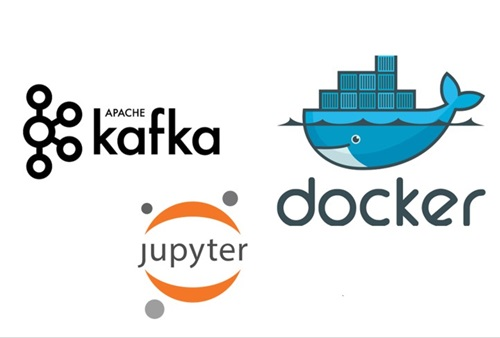

# Portfolio

Welcome to my portfolio! Here, I showcase some of my completed projects: one analyzing the higher education landscape in Brazil in 2020, and the other predicting vehicle prices using Machine Learning. These projects demonstrate my skills in Data Analytics, Data Science, Machine Learning, and data visualization.

## Tools & Technologies

- **Data Cleaning & Analysis**: Microsoft Excel, SQL, Python.
- **Data Visualization**: Power BI, Matplotlib, Seaborn.
- **Machine Learning**: Scikit-learn (Random Forest Regressor, Linear Regression, Decision Tree, Hyperparameter Tuning).
- **Database Management & SQL Tools**: MySQL, DBeaver.
- **Libraries Used**: Pandas, NumPy, Scikit-learn, Matplotlib, Seaborn.
  
---

### Education
- **Postgraduate Lato Sensu in Data Science and Big Data**  
  PUC Minas  
  Apr 2024 - Oct 2025

### Work Experience

- **Jr. Data Specialist**  
  **TecAlliance do Brasil**  
  *Apr 2021 - Present*  
  - Responsible for standardizing and managing datasets related to automotive parts and components, ensuring high quality and consistency of information. 
  - My role involves applying Python to data transformation and validation processes, resulting in a significant increase in operational efficiency. 
  - I maintain direct contact with manufacturers in the automotive sector, providing ongoing support to ensure the accurate and reliable delivery of data, facilitating communication between all parties involved.
  - Utilizing SQL for database queries and reporting, supporting internal analytical needs and contributing to data-driven decision-making.

---

- **SQL Tutor**  
  **Coderhouse Brasil**  
  *Aug 2024 - Present*  
  - As a tutor, I provide support in the creation and modeling of a relational database from scratch, assisting from the generation of the structure to the insertion of information and the implementation of automation processes for database maintenance.
  - Provide guidance in designing, modeling, and maintaining relational databases using all SQL sublanguages (DDL, DML, DCL, TCL).
  - Assist students in creating stored procedures, functions, and triggers to automate database processes.
  - Teach advanced SQL techniques, including joins, queries, CTEs, and window functions, to solve real world problems.
  - Support the development of performance-optimized SQL queries for reporting and decision-making.

---

- **Data Analytics Tutor**  
  **Coderhouse Brasil**  
  *Oct 2023 - Jan 2024*  
  - Guiding students in developing data analysis projects, from initial research to creating interactive dashboards in Power BI.
  - Teaching best practices for data modeling, SQL manipulation, and complex queries (e.g., Join, Union).
  - Helping students build storytelling skills with data and create efficient, trend-focused visualizations.
  - Assisting with Power BI tools (DAX, Power Query) to transform data into actionable insights.

---

- **Mechanical Engineering Intern**  
  **General Motors**  
  *Jul 2019 - Apr 2021*  
  - Assisted in planning and implementing data-driven maintenance strategies to optimize machine uptime.
  - Developed Power BI dashboards to monitor production KPIs, enhancing operational efficiency.
  - Collaborated with engineering teams to analyze equipment data, identifying trends and potential failures.
  - Led a predictive maintenance project using vibration analysis on rotating machinery, reducing costs by preventing equipment failures and extending lifespan. 

---

---

## Projects Overview

### [Project 1: Data Analytics - Higher Education in Brazil in 2020](https://github.com/Gustavo-Saffiotti/Data_Analytics)

This project analyzes the landscape of public higher education in Brazil for the year 2020. It utilizes data from the National Institute of Educational Studies and Research Anísio Teixeira (Inep). The project covers multiple stages, including data collection, cleaning, preparation, and interactive visualization through Power BI.

#### Key Highlights:
- **Tools Used**: Microsoft Excel, Power BI, DAX (Data Analysis Expressions).
- **Key Insights**: The analysis provides a detailed breakdown of undergraduate student profiles, the distribution of students across regions, and the variety of courses offered by different institutions.

#### Explore the Project:
- [Interactive Power BI Dashboard](https://app.powerbi.com/view?r=eyJrIjoiOTcxMjBmN2YtZWFhNS00YzA4LWE2NzEtNzRmZGQ3OWY5ZmE5IiwidCI6IjJkM2IxMDY0LTc1MDEtNDQ0NC04MzRlLTI2YmI2NjNkMzhmZSJ9&pageName=ReportSectione93835085c205b6e0c94)

---

### [Project 2: Data Science - Vehicle Price Prediction using Machine Learning](https://github.com/Gustavo-Saffiotti/Data_Science)

This project uses machine learning to predict the average price of vehicles based on various features such as engine size, fuel type, and vehicle brand. The model was built using **Random Forest Regressor** and optimized through **RandomizedSearchCV** for hyperparameter tuning.

#### Key Highlights:
- **Tools Used**: Python, Jupyter Notebook, Scikit-learn, Pandas, NumPy.
- **Model Performance**: The model performs excellently with high R², meaning it explains almost all the variance in vehicle price predictions.

#### Model Evaluation:
- **MAE**: 4659.15
- **MSE**: 151,821,780.30
- **RMSE**: 12,321.60
- **R²**: 1.00

---

### [Project 3: SQL Files Repository](https://github.com/Gustavo-Saffiotti/SQL_Files)

This repository contains a comprehensive collection of SQL scripts, showcasing the full range of SQL capabilities. It includes examples of:

- **DDL**: Creating and managing database schemas, tables, and relationships.
- **DML**: Querying and manipulating data, including complex `SELECT` queries.
- **DCL**: Managing permissions and user access.
- **TCL**: Handling transactions and ensuring database integrity.
- **Stored Procedures & Triggers**: Automating database tasks and handling database events.

These scripts are designed to demonstrate advanced SQL functionality and serve as learning material for anyone looking to deepen their SQL expertise.

---

### [Project 4: Data Pipeline: Docker, Kafka e Jupyter Notebook](https://github.com/Gustavo-Saffiotti/Data_Pipeline)

In this project, we address the creation of a Big Data environment using Docker to orchestrate several essential services for processing and analyzing large volumes of data. We use Kafka as a tool for ingesting and managing data flows, Jupyter Notebook for interactivity and data analysis, and several other frameworks that are widely used in the Big Data ecosystem. The configuration of the environment is done in an automated way using Docker and Docker Compose, which allows the creation and management of multiple containers to run the services in an efficient and isolated way. The integration between these tools provides a robust foundation for exploring data at scale, processing it in real-time, and performing detailed analysis with ease.

### Tools and Skills Used
- **Docker**: Container platform for creating and managing isolated environments, enabling efficient execution of applications and services.
- **Docker Compose**: Tool to define and run multi-container applications, simplifying the configuration and orchestration of services.
- **Apache Kafka**: Distributed messaging system used for ingesting, storing, and processing large volumes of data in real time.
- **Jupyter Notebook**: Interactive interface for data analysis, which facilitates the execution of Python code and visualization of results in a dynamic way.
- **Pandas**: Python library for data manipulation and analysis, essential for information processing and visualization.
- **Matplotlib**: Library for creating graphs and visualizations, allowing you to represent the distribution of logs and analyzed data.

---
 

## [Additional Project: Mechanical Engineering - Vibration Analysis](https://github.com/Gustavo-Saffiotti/Vibration-Analysis)

This project includes an article I authored on Vibration Analysis, an essential field within mechanical engineering. The study focuses on the **Fast Fourier Transform (FFT)** method, widely used to identify and analyze frequency components in rotating machinery systems.

My foundational knowledge in vibration analysis directly contributed to my work at General Motors, where I applied these concepts in a vibration monitoring project as part of a maintenance initiative aimed at predicting failures. This project achieved significant cost reductions by enabling early detection of mechanical issues through effective vibration monitoring.

---

## Contact & Links

- **[LinkedIn](https://www.linkedin.com/in/gustavo-maldonado-saffiotti)**
- **[GitHub Profile](https://github.com/Gustavo-Saffiotti)**
