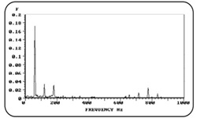

# Portfolio

Welcome to my portfolio! Here, I showcase some of my completed projects: one analyzing the higher education landscape in Brazil in 2020, and the other predicting vehicle prices using Machine Learning. These projects demonstrate my skills in Data Analytics, Data Science, Machine Learning, and data visualization.

## Tools & Technologies

- **Data Cleaning & Analysis**: Microsoft Excel, Pandas, NumPy.
- **Data Visualization**: Power BI, Matplotlib, Seaborn.
- **Machine Learning**: Scikit-learn (Random Forest Regressor, Hyperparameter Tuning).
- **Libraries Used**: Pandas, NumPy, Scikit-learn, Matplotlib, Seaborn.
  
---

### Education
- **Postgraduate Lato Sensu in Data Science and Big Data**  
  PUC Minas  
  Apr 2024 - Oct 2025

### Work Experience

- **Jr. Data Specialist**  
  TecAlliance do Brasil  
  Apr 2021 - Present  
  Responsible for standardizing and managing datasets related to automotive parts and components, ensuring high quality and consistency of information. My role involves applying Python to automate data transformation and validation processes, resulting in a significant increase in operational efficiency.

Additionally, I maintain direct contact with manufacturers in the automotive sector, providing ongoing support to ensure the accurate and reliable delivery of data, facilitating communication between the involved parties. I utilize SQL to perform queries and generate reports in our database, addressing internal analytical needs and contributing to data-driven decision-making.

- **SQL Tutor**  
  Coderhouse Brasil  
  Aug 2024 - Present  
  As a tutor, I provide support in creating and modeling a relational database from scratch, assisting from the generation of the structure to the insertion of information and the implementation of automation processes for maintaining the database. I work with all categories of SQL sublanguage, such as DDL, DML, DCL, and TCL, as well as help in creating Functions, Stored Procedures, and Triggers. I also assist in implementing advanced SQL queries to generate reports that aid in decision-making.

- **Data Analytics Tutor**  
  Coderhouse Brasil  
  Oct 2023 - Jan 2024  
  As a tutor, my role is to provide continuous support to students in the development of data analysis projects, from the initial research phase to the creation of interactive dashboards in Power BI. In addition to guiding them on best practices for data modeling and SQL manipulation, I help students understand DDL and DML sublanguages, and perform advanced queries like Join and Union.

I also assist in developing storytelling skills with data, helping them create efficient charts and apply best practices for trend analysis. In Power BI, I support students in using DAX, M language, and Power Query, enabling them to transform raw data into clear visual insights, which are essential for data-driven decision-making.

- **Mechanical Engineering Intern**  
  General Motors  
  Jul 2019 - Apr 2021  
  Assisted in the planning and implementation of data-driven maintenance strategies aimed at optimizing machine uptime.
Developed dashboards in Power BI to monitor key performance indicators (KPIs) for production lines, significantly contributing to increased operational efficiency.
Collaborated with engineering teams to collect and analyze equipment data, identifying trends and potential failure points.
Implemented a improvement project focused on predictive maintenance, utilizing a vibration analysis model on machines with rotating components, resulting in a considerable cost reduction by preventing failures and extending equipment lifespan.

---

## Projects Overview

### [Project 1: Data Analytics - Higher Education in Brazil in 2020](https://github.com/Gustavo-Saffiotti/Data_Analytics)

This project analyzes the landscape of public higher education in Brazil for the year 2020. It utilizes data from the National Institute of Educational Studies and Research Anísio Teixeira (Inep). The project covers multiple stages, including data collection, cleaning, preparation, and interactive visualization through Power BI.

#### Key Highlights:
- **Tools Used**: Microsoft Excel, Power BI, DAX (Data Analysis Expressions).
- **Key Insights**: The analysis provides a detailed breakdown of undergraduate student profiles, the distribution of students across regions, and the variety of courses offered by different institutions.

#### Explore the Project:
- [Interactive Power BI Dashboard](https://app.powerbi.com/view?r=eyJrIjoiOTcxMjBmN2YtZWFhNS00YzA4LWE2NzEtNzRmZGQ3OWY5ZmE5IiwidCI6IjJkM2IxMDY0LTc1MDEtNDQ0NC04MzRlLTI2YmI2NjNkMzhmZSJ9&pageName=ReportSectione93835085c205b6e0c94)

---

### [Project 2: Data Science - Vehicle Price Prediction using Machine Learning](https://github.com/Gustavo-Saffiotti/Data_Science)

This project uses machine learning to predict the average price of vehicles based on various features such as engine size, fuel type, and vehicle brand. The model was built using **Random Forest Regressor** and optimized through **RandomizedSearchCV** for hyperparameter tuning.

#### Key Highlights:
- **Tools Used**: Python, Jupyter Notebook, Scikit-learn, Pandas, NumPy.
- **Model Performance**: The model performs excellently with high R², meaning it explains almost all the variance in vehicle price predictions.

#### Model Evaluation:
- **MAE**: 4659.15
- **MSE**: 151,821,780.30
- **RMSE**: 12,321.60
- **R²**: 1.00
 

---
## [Additional Project: Mechanical Engineering - Vibration Analysis](https://github.com/Gustavo-Saffiotti/Vibration-Analysis)

This project includes an article I authored on Vibration Analysis, an essential field within mechanical engineering. The study focuses on the **Fast Fourier Transform (FFT)** method, widely used to identify and analyze frequency components in rotating machinery systems.

My foundational knowledge in vibration analysis directly contributed to my work at General Motors, where I applied these concepts in a vibration monitoring project as part of a maintenance initiative aimed at predicting failures. This project achieved significant cost reductions by enabling early detection of mechanical issues through effective vibration monitoring.

---

## Contact & Links

- **[LinkedIn](https://www.linkedin.com/in/gustavo-maldonado-saffiotti)**
- **[GitHub Profile](https://github.com/Gustavo-Saffiotti)**
